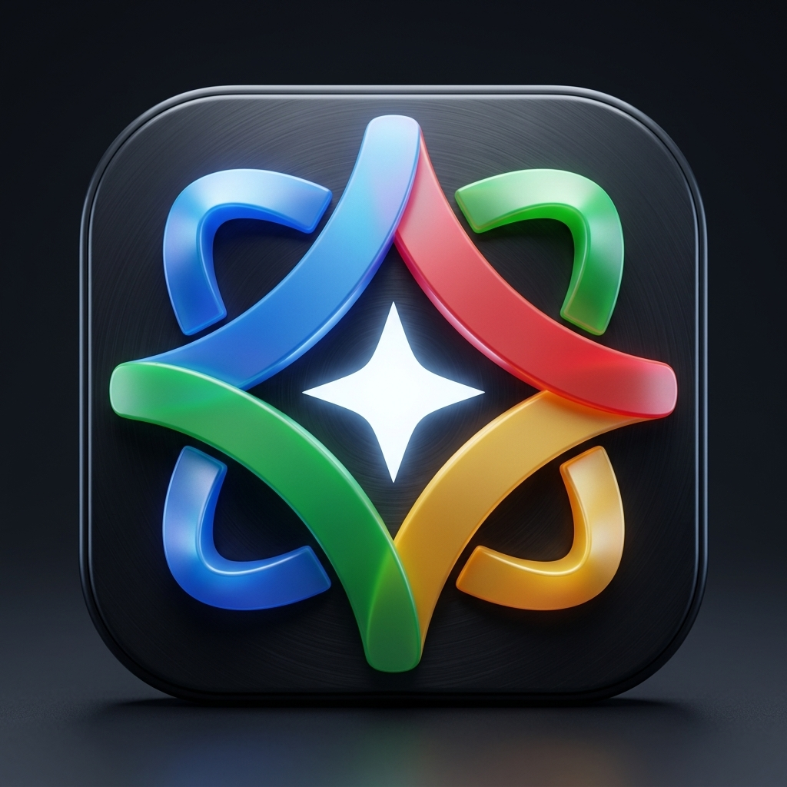

# Gemini Desktop Live

<div align="center">
  
  <h3>Full Desktop Multimodal PC Assistant Powered by Gemini Live</h3>
  <p>Real-time bidirectional voice, native Windows PC automation, 3-window transparent HUD, and Model Context Protocol (MCP) tool integration.</p>
</div>

---

## 🌟 Highlights & Architecture

### 1. Three-Window Transparent HUD with System Tray Docking
* **Center Window (The Multimodal AI Orb)**:
  * Audio-reactive glowing sphere with real-time waveform dynamics.
  * Bidirectional 16kHz input / 24kHz PCM output voice streaming.
  * Draggable anywhere on the desktop, always-on-top toggle, and mini-dock standby mode.
* **Left Window (Control Hub & Settings)**:
  * Real-time task logs, Gemini Live connection management, and instant instruction prompt.
  * Discovered Model Context Protocol (MCP) server telemetry and status.
  * Interactive settings: voice selector (Charon, Aoede, Puck, Fenrir, Kore, Zephyr, etc.), custom API key management, and 6 switchable cybernetic skins (Cyber Cyan, Synthwave Violet, Matrix Emerald, Amber Horizon, Crimson Protocol, Glacial Arctic).
* **Right Window (Perception HUD)**:
  * Live camera monitor showing real-time webcam vision feed.
  * Live desktop screen capture streaming directly to Gemini Live for spatial PC awareness.
  * Zero-scrollbar dynamic auto-fit geometry.

### 2. Native PC Tool Connectivity & MCP Bridge
* **Cursor & Input Automation**: High-precision mouse movement, clicks, drags, and simulated keyboard typing.
* **PowerShell Execution**: Direct headless command execution via native tools (`execute_command`).
* **Filesystem Operations**: Read, write, and inspect directories (`read_file`, `write_file`, `list_directory`).
* **Hardware & Telemetry**: CPU core monitoring, RAM usage, and live system state inspection.
* **MCP Discovery**: Automatic detection and bridging of local MCP servers (e.g., `filesystem`, `memory`, `github`, `chrome-devtools-mcp`).

---

## 🚀 Quick Start

### Prerequisites
* [Node.js](https://nodejs.org/) (v18+)
* Windows 10/11
* Google Gemini API Key with Gemini Live access (from [Google AI Studio](https://aistudio.google.com/))

### Installation
1. Clone the repository:
   ```bash
   git clone https://github.com/batch15studios/gemini-desktop-live.git
   cd gemini-desktop-live
   ```

2. Install dependencies:
   ```bash
   npm install
   ```

3. Configure your API key:
   * Copy `.env.example` to `.env`:
     ```bash
     copy .env.example .env
     ```
   * Add your Gemini API key inside `.env` or configure it directly in the app's Settings panel.

4. Start the application:
   ```bash
   npm start
   ```

---

## ⌨️ Shortcuts & System Tray Controls

* **Global Hotkey**: `Ctrl + Shift + Space` toggles wake/summon and standby.
* **System Tray (Taskbar)**:
  * Double-click the tray icon to show or hide the HUD.
  * Right-click for quick actions:
    * **Show Full Desktop HUD**: Restores all 3 transparent panels.
    * **Mini Floating Toolbar**: Collapses to compact floating mode.
    * **Floating Orb Only**: Keeps the conversational orb visible while tucking side panels into the tray.
    * **Toggle Microphone / Vision / Screen Share**: Instantly toggle sensor feeds.
    * **Reconnect Gemini Live**: Fast reconnect on network changes.

---

## 🎨 Interface Themes

Switch skins on the fly from the **Settings** tab in the Left Control Hub:
* **Cyber Cyan** (Nexus)
* **Synthwave Violet** (Quantum)
* **Matrix Emerald** (Bio-Digital)
* **Amber Horizon** (Solar Flare)
* **Crimson Protocol** (Stealth Ops)
* **Glacial Arctic** (Cryo-Slate)

---

## 📄 License

MIT © [Ryan Satterfield](https://github.com/batch15studios)
